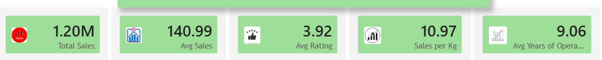
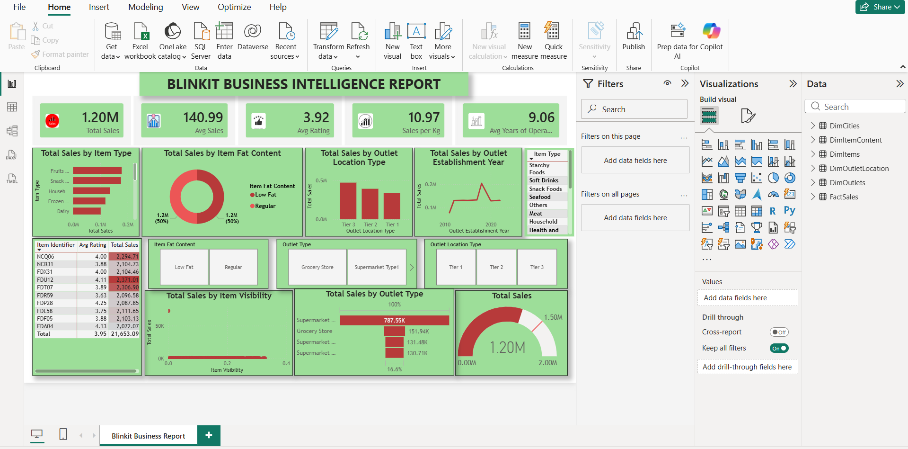
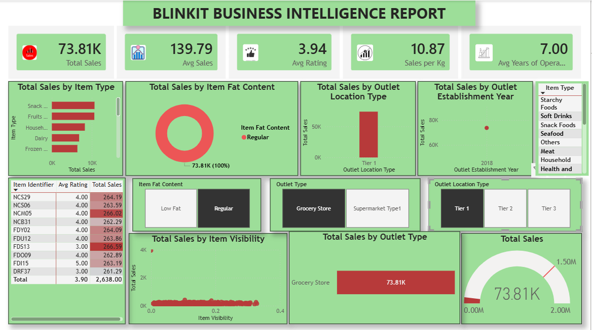
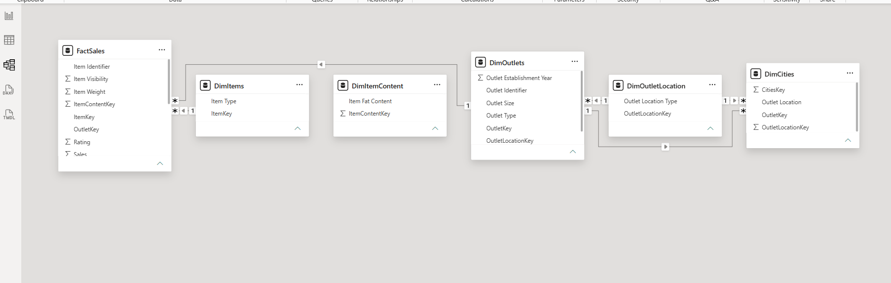

# 🛒 Blinkit Sales Analysis

## 📊 Overview
Interactive Business Intelligence dashboard built using Power BI and DAX 
to analyze Blinkit's grocery sales performance across outlets, item types, 
and locations.

## 🔑 Key Metrics
- 💰 Total Sales: 1.20M
- 📈 Average Sales: 140.99
- ⭐ Average Rating: 3.92
- ⚖️ Sales per Kg: 10.97

## 📌 Features
- Sales breakdown by Item Type, Fat Content, Outlet Type
- Outlet performance by Location Tier and Establishment Year
- Dynamic filters for interactive analysis
- Star schema data model with Fact and Dimension tables

## 🛠 Tools Used
- Power BI
- DAX
- Excel (Data Source)

## 📷 Dashboard Preview

## 📁 Dataset

[Download Dataset](Blinkit_Sales_Data.zip)
